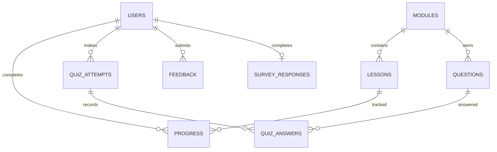

# Database design

```mermaid
erDiagram
 USERS ||--o{ PROGRESS : completes
 MODULES ||--o{ LESSONS : contains
 LESSONS ||--o{ PROGRESS : tracked
 MODULES ||--o{ QUESTIONS : owns
 USERS ||--o{ QUIZ_ATTEMPTS : makes
 QUIZ_ATTEMPTS ||--o{ QUIZ_ANSWERS : records
 QUESTIONS ||--o{ QUIZ_ANSWERS : answered
 USERS ||--o{ FEEDBACK : submits
 USERS ||--o| SURVEY_RESPONSES : completes
```
Foreign keys and a unique `(user_id, lesson_id)` progress constraint prevent duplicate lesson completion.
