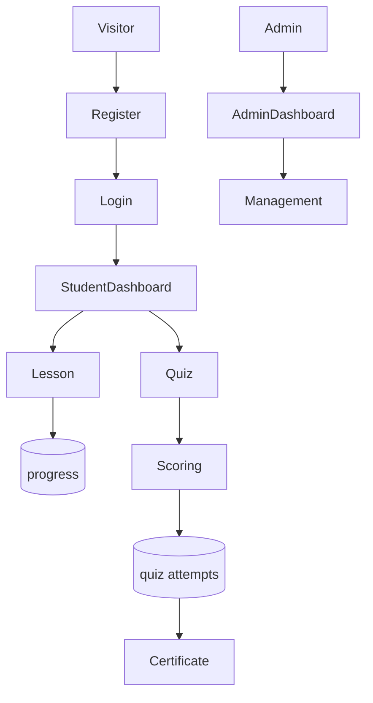
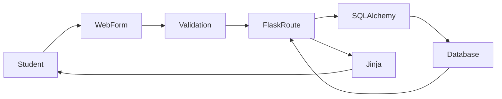
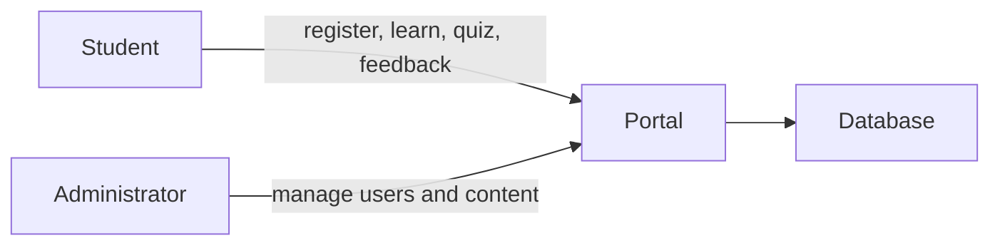

# Application and data flow

```mermaid
flowchart TD
Visitor-->Register-->Login
Login-->StudentDashboard
StudentDashboard-->Lesson-->Completion[(progress)]
StudentDashboard-->Quiz-->Scoring-->Attempts[(quiz attempts)]
Attempts-->Certificate
Admin-->AdminDashboard-->Management
```

```mermaid
flowchart LR
Student-->WebForm-->Validation-->FlaskRoute-->SQLAlchemy-->Database
Database-->FlaskRoute-->Jinja-->Student
```

```mermaid
flowchart LR
Student -->|register, learn, quiz, feedback| Portal
Administrator -->|manage users and content| Portal
Portal --> Database
```
