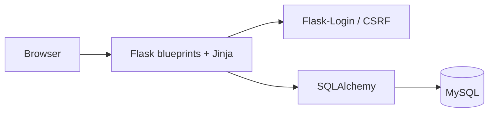

# System architecture

```mermaid
flowchart LR
Browser[Browser] --> Flask[Flask blueprints + Jinja]
Flask --> Auth[Flask-Login / CSRF]
Flask --> ORM[SQLAlchemy]
ORM --> DB[(MySQL)]
```
The application factory registers separated public, authentication, student and administrator blueprints.
